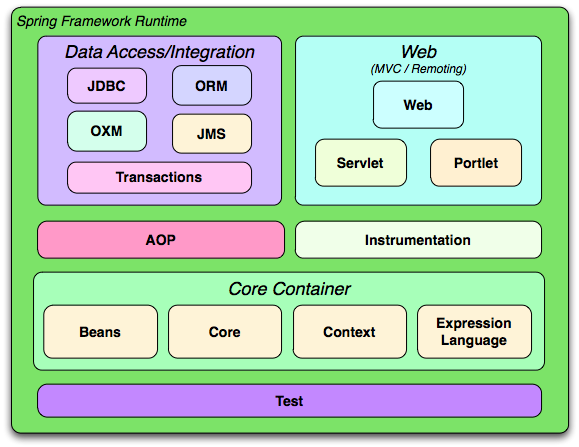

# Spring Framework

Spring is Dependency Injection Framework.
Spring Framework provides many sub-frameworks AOP,ORM,JDBC,MVC etc.

What is dependency.?

* WebLayer

    * JSP,Servlet,MVC,WEB, VIEW

* Business Layer
 

* Data Layer

    * Hibernate
    * JDBC
    * IBATIS

 
 

* Core Container
    * Beans
    * Core
    * Context
    * Expression language

Three Things to spring manage for object/beans creation

* About Beans
* About dependencies
* Where to search the beans

